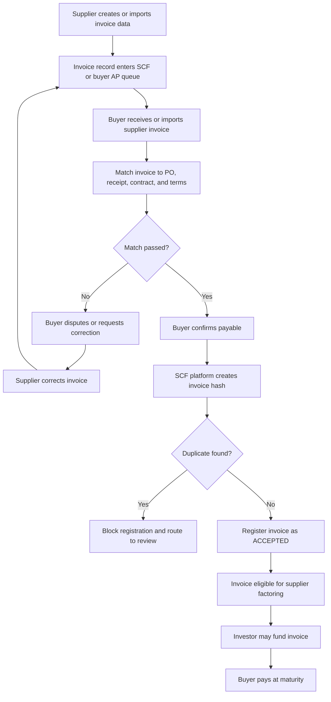
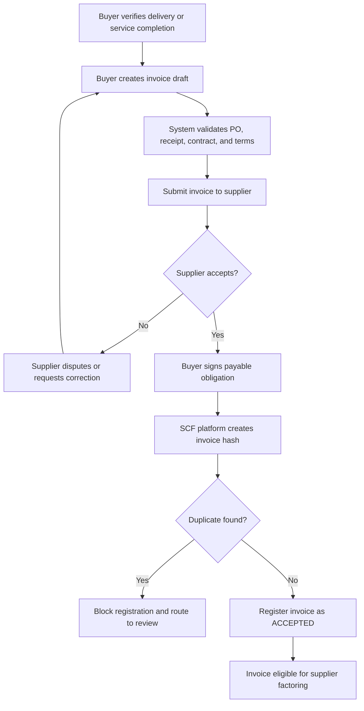

# User Case: Buyer Validates Supplier Invoice and Uploads to SCF System

## 1. Purpose

This workflow defines how a Buyer/Core Enterprise handles invoices in the SCF platform through two supported invoice modes. The invoice mode is a commercial setting negotiated between the supplier and buyer, usually defined in their contract, onboarding agreement, ERP integration setup, or trading relationship profile.

1. **Primary flow: Supplier-issued invoice**
   - Supplier creates and issues the invoice.
   - Buyer receives, validates, accepts, and confirms the payable.
   - The accepted invoice becomes eligible for SCF financing.

2. **Alternative flow: Buyer-created invoice / self-billing**
   - Buyer creates the invoice only when the commercial model supports reverse invoicing.
   - Supplier reviews and accepts the buyer-created invoice.
   - Buyer signs the final payable obligation.

The main design principle is:

```
Supplier invoice value is not financeable until the buyer confirms it as Due Value.
```

In SCF, the investor is not financing a raw invoice request. The investor is financing a buyer-accepted payable backed by delivery, contract, and payment-term evidence.

## 2. Invoice Mode Negotiation

Before invoices enter the SCF lifecycle, the supplier and buyer must agree which invoice mode applies to their relationship.

| Invoice mode | Who creates the invoice | When to use |
| --- | --- | --- |
| Supplier-issued invoice | Supplier | Default commercial model. Supplier issues invoice after goods/services are delivered. |
| Buyer-created invoice / self-billing | Buyer | Used only when the buyer and supplier agree that buyer systems calculate and generate the invoice-like payable document. |

The selected mode can be stored at:

- Supplier-buyer relationship level.
- Contract level.
- Purchase order level.
- ERP integration mapping level.
- Individual invoice level when exceptions are allowed.

Mode rules:

- Supplier-issued invoice should be the default mode.
- Buyer-created invoice requires explicit self-billing authorization.
- The selected mode controls which party can create the invoice record.
- Regardless of mode, SCF eligibility still requires buyer confirmation of the payable.

## 3. Actors

| Actor | Role in this workflow |
| --- | --- |
| Supplier / SME | Issues invoice in the primary flow; reviews buyer-created invoice in self-billing flow; requests financing after buyer acceptance. |
| Buyer / Core Enterprise | Receives, matches, validates, disputes, accepts, and signs payable obligation. |
| SCF Platform | Validates invoice data, runs duplicate checks, creates invoice hash, registers invoice state, and exposes eligible invoices for financing. |
| Investor / Factor | Funds the accepted invoice after it becomes financeable. |
| Circle / Arc Infrastructure | Provides programmable wallets, USDC settlement rails, and smart contract execution. |

## 4. Value-State Interpretation

| State | Business meaning | SCF meaning |
| --- | --- | --- |
| `ASK_VALUE` | Supplier asks buyer to pay through invoice issuance. | Invoice exists, but is not yet financeable. |
| `MATCHING` | Buyer compares invoice against PO, receipt, contract, tax, and tolerance rules. | Invoice is under validation. |
| `DISPUTED` | Buyer rejects or requests correction. | Invoice cannot be financed. |
| `DUE_VALUE` | Buyer accepts invoice as a payable obligation. | Invoice can be registered as a financeable receivable. |
| `FACTORED` | Investor funds accepted receivable. | Supplier receives early payment. |
| `SETTLED` | Buyer pays at maturity. | Escrow distributes funds to investor and supplier according to terms. |

## 5. Preconditions

- Buyer has completed organization onboarding, KYB, and wallet setup.
- Supplier is registered or invited to the SCF platform.
- Buyer and supplier have an active commercial relationship.
- Purchase order, delivery confirmation, service completion, or goods receipt data exists.
- Payment terms are known, including currency, due date, discounts, and tolerance rules.
- Buyer has permission to accept payables and approve SCF eligibility.
- Supplier-buyer relationship has an agreed invoice mode: `SUPPLIER_ISSUED` or `SELF_BILLING`.

## 6. Primary Flow: Supplier-Issued Invoice

### Workflow Summary



### Step 1: Supplier Issues Invoice

The supplier creates the invoice based on delivered goods or completed services. The supplier does not need to upload a PDF invoice file for the SCF workflow to work. The platform can operate from structured invoice data, ERP/API imports, or manual invoice entry.

Supplier invoice creation channels:

| Channel | Description | PDF required? |
| --- | --- | --- |
| Manual creation in supplier portal | Supplier enters invoice number, buyer, amount, dates, line items, PO reference, and settlement details. | No |
| Supplier ERP/AP import | Supplier imports invoice records from its ERP, accounting, billing, or AP/AR system through API, CSV, XML, or connector. | No |
| Optional PDF attachment | Supplier attaches invoice PDF as supporting evidence or for buyer convenience. | Optional |

Important rule:

```
The invoice record is the finance workflow object. The PDF is only supporting evidence.
```

Required invoice data:

| Field | Description |
| --- | --- |
| Supplier legal name | Legal entity issuing the invoice. |
| Supplier tax ID / business ID | Used for identity and duplicate checks. |
| Buyer legal name | Buyer entity that owes payment. |
| Buyer tax ID / business ID | Used for identity and duplicate checks. |
| Invoice number | Supplier-generated invoice reference. |
| Invoice amount | Face value of the receivable. |
| Currency | Invoice currency; settlement may be USDC. |
| Issue date | Date invoice is issued. |
| Maturity date | Payment due date. |
| PO reference | Purchase order reference, if available. |
| Delivery reference | Goods receipt, delivery note, or service approval. |
| Line items | Quantity, unit price, tax, freight, discount, and adjustments. |

Initial invoice state:

```
SUPPLIER_ISSUED
```

### Step 2: Buyer Receives or Imports Supplier Invoice

The buyer receives or imports the supplier-issued invoice through one of the supported channels.

Buyer-side intake channels:

| Channel | Description | PDF required? |
| --- | --- | --- |
| Supplier submits structured invoice to SCF | Supplier-created invoice record appears in buyer review queue. | No |
| Buyer imports from buyer ERP/AP system | Buyer imports supplier-issued invoice records already captured in its ERP/AP workflow. | No |
| Buyer uploads supplier invoice PDF | Buyer uploads a PDF received from supplier; system can parse/extract invoice data. | Yes for this channel only |
| Buyer imports invoice package | Buyer imports PDF plus structured metadata from email, API, EDI, XML, CSV, or ERP connector. | Optional |

The system should support both structured-first and document-first intake. For MVP, structured invoice data should be treated as the source of workflow truth; PDF files are evidence, not mandatory workflow inputs.

System actions:

- Parse or import invoice data.
- Identify buyer and supplier.
- Link invoice to buyer workspace.
- Link optional PDF or supporting documents if provided.
- Set status to `PENDING_BUYER_REVIEW`.
- Notify buyer AP or treasury user.

### Step 3: Buyer Validates Invoice

The buyer checks whether the supplier invoice reflects true delivered value.

Validation checks:

| Check | Purpose |
| --- | --- |
| Supplier identity | Confirm invoice comes from approved supplier. |
| PO match | Confirm invoice references valid purchase order. |
| Receipt match | Confirm goods/services were received or accepted. |
| Quantity match | Compare invoiced quantity against receipt quantity. |
| Price match | Compare invoiced price against contract or PO. |
| Tax/freight/discount check | Confirm calculated adjustments are valid. |
| Maturity date check | Confirm due date follows payment terms. |
| Beneficiary check | Confirm supplier wallet or bank beneficiary is approved. |
| Duplicate check | Detect exact and near-duplicate invoices. |

Buyer decision:

| Decision | Result |
| --- | --- |
| Accept | Invoice moves toward payable confirmation. |
| Request correction | Invoice becomes `DISPUTED`; supplier must revise. |
| Reject | Invoice becomes `REJECTED`; not financeable. |
| Hold | Invoice remains pending for internal approval. |

### Step 4: Buyer Accepts and Confirms Payable

When validation passes, the buyer accepts the invoice as a payable obligation.

Buyer confirmations:

- Goods or services were received.
- Invoice terms match PO, receipt, and contract data.
- Amount, tax, freight, and discount are correct.
- Supplier beneficiary is valid.
- Buyer agrees to pay by maturity date.
- Buyer allows or disables SCF financing for this payable.

Buyer signing statement:

```
I confirm that this supplier-issued invoice represents a valid payable obligation
of the buyer and that payment will be made according to the stated maturity date
and settlement instructions.
```

System actions:

1. Normalize invoice data.
2. Create deterministic `invoiceHash`.
3. Check `InvoiceRegistry` for duplicates.
4. Register accepted invoice on the SCF platform.
5. Store buyer signature and audit trail.
6. Set status to `ACCEPTED` or `ACCEPTED_NON_FINANCEABLE`.

Suggested hash inputs:

```
invoiceHash = hash(
  supplierTaxId,
  buyerTaxId,
  supplierInvoiceNumber,
  purchaseOrderId,
  deliveryReference,
  amount,
  maturityDate
)
```

### Step 5: Invoice Becomes Financeable

If buyer financing permission is enabled, the accepted invoice becomes visible to the supplier as an eligible receivable.

System actions:

- Publish invoice to supplier financing view.
- Allow supplier to request factoring.
- Allow investors to review invoice, buyer credit, supplier history, and maturity window.
- Move invoice through the financing lifecycle:

```
ACCEPTED -> FACTORING_REQUESTED -> FACTORED -> SETTLED
```

## 7. Alternative Flow: Buyer-Created Invoice / Self-Billing

Self-billing applies only when the commercial arrangement allows the buyer to generate the payable document on behalf of the supplier.

This mode is not simply a buyer upload path. It is a negotiated invoice mode in which the buyer is authorized to create the invoice-like payable record from buyer-verified data.

Typical use cases:

- Buyer controls verified quantity data.
- Buyer calculates recurring settlement amounts.
- Supplier has agreed to buyer-generated invoicing.
- Contract requires self-billing or evaluated receipt settlement.
- Buyer ERP is the source of truth for received value.

### Self-Billing Workflow Summary



### Self-Billing Steps

1. Buyer verifies delivery, service completion, or measured usage.
2. Buyer creates invoice draft from PO, receipt, contract, tax, and adjustment data.
3. System marks invoice as `SELF_BILLING_DRAFT`.
4. Buyer submits invoice to supplier for review.
5. Supplier accepts, disputes, or rejects the buyer-created invoice.
6. If supplier accepts, buyer signs the payable obligation.
7. SCF platform creates invoice hash and checks duplicates.
8. Accepted self-billed invoice becomes eligible for factoring if financing is enabled.

Self-billing state path:

```
SELF_BILLING_DRAFT -> PENDING_SUPPLIER_REVIEW -> ACCEPTED -> FACTORING_REQUESTED -> FACTORED -> SETTLED
```

Self-billing business rules:

- Buyer-created invoices require an enabled self-billing agreement.
- Supplier acceptance is required unless the supplier has pre-authorized self-billing.
- Buyer-created invoices must preserve source document links.
- Corrections must create version history.
- Only the latest accepted version can become financeable.

## 8. Alternative and Exception Flows

### A1. Supplier Invoice Is Disputed

If buyer validation fails, the invoice state becomes `DISPUTED`.

Common dispute reasons:

- Incorrect quantity.
- Incorrect price.
- Missing tax, freight, discount, or credit memo.
- Wrong maturity date.
- Wrong buyer entity.
- Wrong supplier beneficiary.
- Goods or services not received.

Resolution:

- Buyer sends dispute reason to supplier.
- Supplier corrects invoice or provides evidence.
- Corrected invoice returns to `PENDING_BUYER_REVIEW`.
- Platform preserves version history.

### A2. Duplicate Invoice Detected

If the invoice hash already exists, the system blocks registration.

System message:

```
This invoice appears to be already registered. Registration blocked to prevent duplicate financing.
```

Resolution:

- Authorized users can view the existing invoice record.
- Platform operator can review near-duplicates.
- Corrected invoices must link back to the prior version.

### A3. Buyer Accepts Payable but Disables Financing

The buyer may confirm the payable while disabling SCF financing.

System behavior:

- Invoice status becomes `ACCEPTED_NON_FINANCEABLE`.
- Invoice remains visible for payment tracking.
- Supplier cannot request factoring unless buyer later enables financing.

### A4. Batch Upload or ERP Import

Buyer or supplier may upload multiple invoices through CSV, XML, API, or ERP connector.

System actions:

- Validate each invoice independently.
- Produce a batch validation report.
- Register accepted invoices.
- Hold invalid invoices in an exception queue.
- Allow correction and reprocessing.

### A5. PDF Uploaded Without Structured Invoice Data

If the buyer uploads a supplier invoice PDF without structured fields, the system should extract the invoice data and route it to validation before buyer acceptance.

System actions:

- Run OCR or document extraction.
- Ask buyer to confirm extracted fields.
- Link the PDF as supporting evidence.
- Create a structured invoice record.
- Continue with `PENDING_BUYER_REVIEW`.

### A6. Structured Invoice Imported Without PDF

If supplier or buyer imports structured invoice data without PDF, the system should allow the invoice workflow to continue.

System actions:

- Validate required invoice fields.
- Preserve import source and integration trace.
- Allow optional supporting document attachment later.
- Continue with buyer matching and acceptance.

## 9. Data Model

### Invoice Entity

| Field | Type | Required | Notes |
| --- | --- | --- | --- |
| `invoiceId` | string | Yes | Internal platform ID. |
| `invoiceOrigin` | enum | Yes | `SUPPLIER_ISSUED` or `SELF_BILLED`. |
| `invoiceModeAgreementId` | string | Optional | Relationship, contract, or PO-level agreement defining invoice mode. |
| `invoiceNumber` | string | Yes | Supplier invoice number or buyer self-billing number. |
| `invoiceHash` | bytes32/string | Yes after registration | Unique anti-duplicate key. |
| `buyerId` | string | Yes | Buyer organization ID. |
| `supplierId` | string | Yes | Supplier organization ID. |
| `buyerTaxId` | string | Yes | Buyer legal identifier. |
| `supplierTaxId` | string | Yes | Supplier legal identifier. |
| `purchaseOrderId` | string | Optional | Preferred matching reference. |
| `deliveryReference` | string | Optional | Goods receipt, delivery note, or service approval. |
| `amount` | decimal | Yes | Invoice face value. |
| `currency` | string | Yes | Prefer `USDC` for settlement or stablecoin equivalent. |
| `issueDate` | date | Yes | Invoice creation date. |
| `maturityDate` | date | Yes | Payment due date. |
| `status` | enum | Yes | Workflow state. |
| `financingAllowed` | boolean | Yes | Buyer permission for SCF. |
| `sourceDocuments` | array | Yes | Invoice, PO, receipt, contract, delivery proof. |
| `invoicePdfRequired` | boolean | Yes | Usually `false`; true only for document-first intake requirements. |
| `invoicePdfUrl` | string | Optional | Supporting invoice PDF if uploaded or imported. |
| `intakeChannel` | enum | Yes | `SUPPLIER_PORTAL`, `SUPPLIER_ERP`, `BUYER_ERP`, `BUYER_UPLOAD`, `API`, `CSV`, `XML`, `EDI`. |
| `createdBy` | userId | Yes | Supplier user, buyer user, or API integration. |
| `buyerSignature` | string | Conditional | Required for accepted payable. |
| `supplierAcceptance` | string | Conditional | Required for self-billed invoice unless pre-authorized. |
| `versionOf` | string | Optional | Prior invoice ID if this is a correction. |

### Status Values

| Status | Meaning |
| --- | --- |
| `SUPPLIER_ISSUED` | Supplier created invoice before buyer review. |
| `PENDING_BUYER_REVIEW` | Buyer must validate supplier-issued invoice. |
| `SELF_BILLING_DRAFT` | Buyer created invoice draft under self-billing model. |
| `PENDING_SUPPLIER_REVIEW` | Supplier must review buyer-created invoice. |
| `VALIDATION_FAILED` | Invoice has missing or invalid data. |
| `DISPUTED` | Buyer or supplier requested correction. |
| `REJECTED` | Invoice was rejected and cannot be financed. |
| `ACCEPTED` | Buyer confirmed payable obligation and financing is allowed. |
| `ACCEPTED_NON_FINANCEABLE` | Payable is valid but not eligible for SCF financing. |
| `FACTORING_REQUESTED` | Supplier requested financing. |
| `FACTORED` | Investor funded the receivable. |
| `SETTLED` | Buyer paid at maturity and escrow distributed funds. |
| `CANCELLED` | Invoice was voided before acceptance. |

## 10. Business Rules

- Supplier-issued invoice is the primary workflow.
- Buyer-created invoice is allowed only under self-billing or reverse-invoicing agreements.
- Invoice mode must be negotiated between supplier and buyer before invoice creation, or selected as an explicit exception.
- Supplier-issued invoices can be manually created by the supplier without uploading a PDF.
- Supplier-issued invoices can be imported from the supplier ERP/AP/AR system without uploading a PDF.
- Buyer can upload a supplier invoice PDF, but PDF upload is one intake channel, not a universal requirement.
- Buyer can import supplier-issued invoices from the buyer ERP/AP system without uploading a PDF.
- Structured invoice data is the workflow source of truth; invoice PDF is supporting evidence unless a document-first policy applies.
- A supplier-issued invoice cannot be financed until buyer acceptance.
- A self-billed invoice cannot be financed until supplier acceptance and buyer signature, unless pre-authorized self-billing applies.
- Buyer must sign or otherwise cryptographically confirm the payable obligation before SCF eligibility.
- Duplicate invoice hashes must be blocked before registration.
- Near-duplicate invoices must route to review.
- Corrections must create version history.
- Only the latest accepted version can be financeable.
- Buyer must explicitly allow financing.
- Invoice maturity date must be later than issue date.
- Invoice amount must be positive.
- Settlement wallet must belong to the verified supplier or approved beneficiary.
- All accepted invoices must have a complete audit trail.

## 11. UI Requirements

### Invoice Mode Setup

Core sections:

- Supplier-buyer relationship selector.
- Invoice mode selector: `Supplier-issued` or `Buyer-created / self-billing`.
- Contract or PO reference.
- Self-billing authorization status.
- Allowed intake channels.
- PDF requirement setting.

Primary actions:

| Action | Description |
| --- | --- |
| Set Supplier-Issued Mode | Supplier creates invoice; buyer validates and accepts. |
| Enable Self-Billing Mode | Buyer creates invoice only under authorized agreement. |
| Configure Intake Channels | Choose portal, ERP, API, CSV, XML, EDI, or PDF upload options. |
| Save Mode Agreement | Store selected mode for future invoices. |

### Buyer Invoice Review Screen

Core sections:

- Supplier invoice summary.
- PO, receipt, delivery, and contract matching panel.
- Line item comparison.
- Tax, freight, discount, and adjustment review.
- Maturity date and payment terms.
- Duplicate check result.
- Financing permission toggle.
- Validation and exception panel.

Primary actions:

| Action | Description |
| --- | --- |
| Accept Payable | Confirm invoice as buyer obligation. |
| Request Correction | Send discrepancy reason to supplier. |
| Reject Invoice | Reject invalid invoice. |
| Hold for Approval | Route to internal approval queue. |
| Disable Financing | Accept payable without SCF eligibility. |

### Self-Billing Creation Screen

Core sections:

- Supplier selector.
- Source document selector.
- Invoice line items.
- Tax, freight, discount, and adjustment fields.
- Maturity date and payment terms.
- Financing permission toggle.
- Supplier review status.

Primary actions:

| Action | Description |
| --- | --- |
| Save Draft | Save incomplete self-billed invoice. |
| Validate | Run matching and duplicate checks. |
| Submit to Supplier | Send buyer-created invoice to supplier for review. |
| Cancel Invoice | Void draft invoice. |

### Supplier Invoice Creation Screen

Core sections:

- Buyer selector.
- Invoice number and dates.
- PO and delivery references.
- Line items, tax, freight, discount, and adjustments.
- Settlement beneficiary.
- Optional PDF/supporting document attachment.
- ERP/import source indicator.

Primary actions:

| Action | Description |
| --- | --- |
| Create Invoice Manually | Create structured invoice record without requiring PDF upload. |
| Import From ERP | Import invoice data from supplier ERP/AP/AR system. |
| Attach PDF | Add invoice PDF as optional supporting evidence. |
| Submit to Buyer | Send invoice record to buyer review queue. |

### Supplier Review Screen for Self-Billing

Core sections:

- Buyer-created invoice summary.
- Source evidence.
- Payment terms.
- Financing eligibility.
- Acceptance or dispute actions.

Primary actions:

| Action | Description |
| --- | --- |
| Accept Invoice | Confirm buyer-created invoice is correct. |
| Request Correction | Send correction request to buyer. |
| Reject Invoice | Reject payable if invalid. |

## 12. API / Smart Contract Events

Suggested API events:

| Event | Description |
| --- | --- |
| `invoice.supplier_issued` | Supplier created or uploaded invoice. |
| `invoice.mode_agreed` | Supplier and buyer invoice mode was configured. |
| `invoice.imported_from_supplier_erp` | Supplier-issued invoice imported from supplier system. |
| `invoice.imported_from_buyer_erp` | Supplier-issued invoice imported from buyer system. |
| `invoice.pdf_uploaded_by_buyer` | Buyer uploaded supplier invoice PDF. |
| `invoice.received_by_buyer` | Invoice entered buyer review queue. |
| `invoice.validation_passed` | Invoice passed matching and validation. |
| `invoice.validation_failed` | Invoice failed matching or required checks. |
| `invoice.duplicate_detected` | Duplicate or near-duplicate invoice found. |
| `invoice.disputed` | Buyer or supplier requested correction. |
| `invoice.buyer_accepted` | Buyer confirmed payable obligation. |
| `invoice.self_billing_draft_created` | Buyer created self-billing invoice draft. |
| `invoice.submitted_to_supplier` | Self-billed invoice sent to supplier review. |
| `invoice.supplier_accepted` | Supplier accepted buyer-created invoice. |
| `invoice.accepted` | Invoice became eligible for SCF. |
| `invoice.financing_disabled` | Buyer accepted payable but disabled financing. |

Suggested smart contract events:

```solidity
event InvoiceRegistered(bytes32 indexed invoiceHash, address indexed buyer, address indexed supplier, uint256 amount);
event BuyerAcceptedPayable(bytes32 indexed invoiceHash, address indexed buyer, uint256 maturityDate);
event SupplierAcceptedSelfBill(bytes32 indexed invoiceHash, address indexed supplier);
event InvoiceDisputed(bytes32 indexed invoiceHash, string reason);
event InvoiceCancelled(bytes32 indexed invoiceHash, string reason);
event DuplicateInvoiceRejected(bytes32 indexed invoiceHash);
```

## 13. Controls and Risk Mitigation

| Risk | Control |
| --- | --- |
| Supplier issues invoice for undelivered goods | Buyer must match invoice to PO, goods receipt, delivery proof, or service approval. |
| Buyer self-bills without authorization | Require self-billing agreement or supplier pre-authorization. |
| Incorrect invoice mode used | Enforce supplier-buyer mode agreement before allowing invoice creation. |
| PDF treated as legal truth despite bad extracted data | Require buyer confirmation of structured fields after PDF extraction. |
| Imported invoice lacks supporting document | Allow workflow if required structured fields and source trace are present; flag evidence gap if policy requires attachment. |
| Supplier disputes self-billed amount | Supplier review is mandatory unless pre-authorized. |
| Duplicate financing | Use deterministic `invoiceHash` and registry lookup. |
| Wrong beneficiary | Validate supplier wallet and approved beneficiary records. |
| Unauthorized buyer user | Enforce role-based permission and approval limits. |
| Amount manipulation | Preserve source documents and version history. |
| Late buyer payment | Record payment behavior in buyer profile and settlement history. |

## 14. Acceptance Criteria

- Supplier and buyer can configure invoice mode as supplier-issued or buyer-created/self-billing.
- Supplier-issued invoice can enter buyer review queue.
- Supplier can manually create supplier-issued invoice without uploading PDF.
- Supplier can import supplier-issued invoice from supplier ERP/AP/AR system.
- Buyer can upload supplier invoice PDF and convert it into structured invoice record.
- Buyer can import supplier-issued invoice from buyer ERP/AP system.
- Buyer can validate invoice against PO, receipt, contract, and terms.
- Buyer can accept, dispute, reject, or hold supplier-issued invoice.
- Accepted supplier-issued invoice generates an invoice hash.
- System blocks exact duplicate invoice registration.
- Buyer can enable or disable financing eligibility.
- Accepted financeable invoice becomes visible to supplier for factoring.
- Buyer-created self-billing flow exists as a separate alternative path.
- Self-billed invoice requires supplier acceptance unless pre-authorized.
- Audit trail records invoice origin, validations, disputes, signatures, and state transitions.
- Invoice state cannot skip required acceptance steps.

## 15. Open Questions

- Which invoice intake channel is MVP priority: supplier portal, buyer upload, ERP import, or API?
- Should invoice mode be configured at supplier-buyer relationship level, contract level, PO level, or all three?
- Which supplier ERP/AP/AR import formats should be supported first?
- Which buyer ERP/AP import formats should be supported first?
- Is invoice PDF required for any target jurisdiction or only optional evidence for MVP?
- Should buyer acceptance be an on-chain wallet signature for MVP, or can the first version use off-chain audit log plus later settlement signature?
- Should self-billing require supplier acceptance in all cases, or support pre-authorized supplier agreements?
- Should fiat-denominated invoices settle in USDC at a locked FX rate?
- Which ERP connectors are required first?
- Should near-duplicate detection use deterministic rules only, or also include AI/anomaly scoring?
- What legal language is required for buyer payable acceptance by target jurisdiction?

## 16. MVP Scope Recommendation

For the first MVP, implement the primary supplier-issued invoice path:

1. Supplier and buyer configure invoice mode as `SUPPLIER_ISSUED`.
2. Supplier manually creates structured invoice data without requiring PDF upload.
3. Buyer can alternatively import the supplier-issued invoice from buyer ERP/AP system or upload a supplier invoice PDF.
4. Buyer reviews invoice against PO, receipt, amount, and maturity date.
5. Buyer accepts or disputes invoice.
6. System generates invoice hash for accepted invoice.
7. System blocks exact duplicates.
8. Buyer enables financing.
9. Supplier sees accepted invoice and can request factoring.

Self-billing should be included as a documented alternative flow, but can be implemented after the primary supplier-issued invoice workflow is stable.
