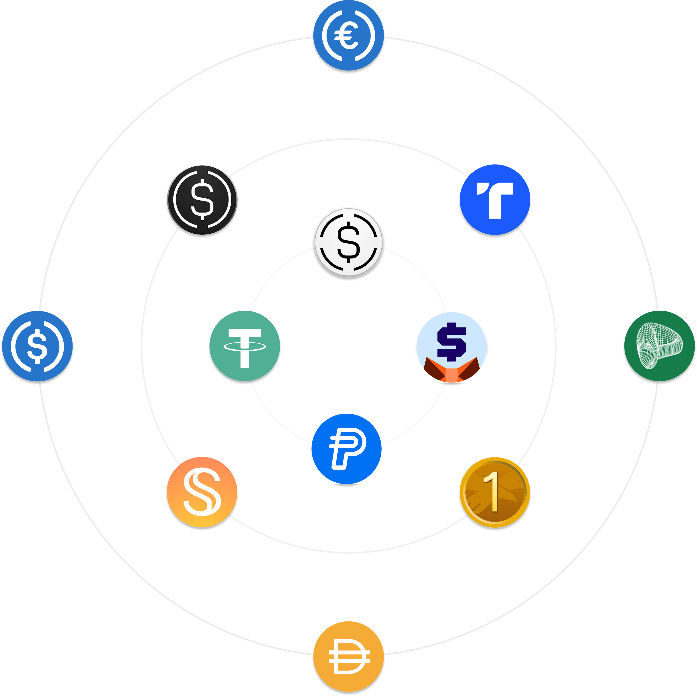
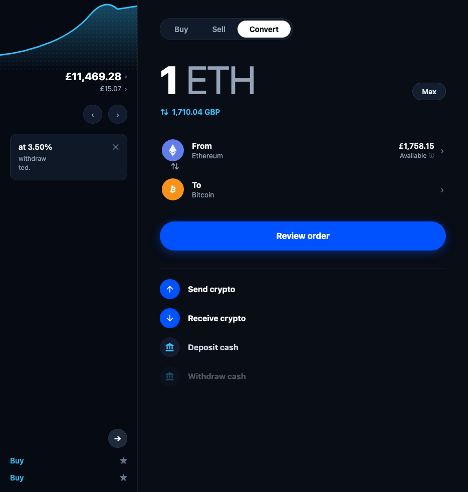
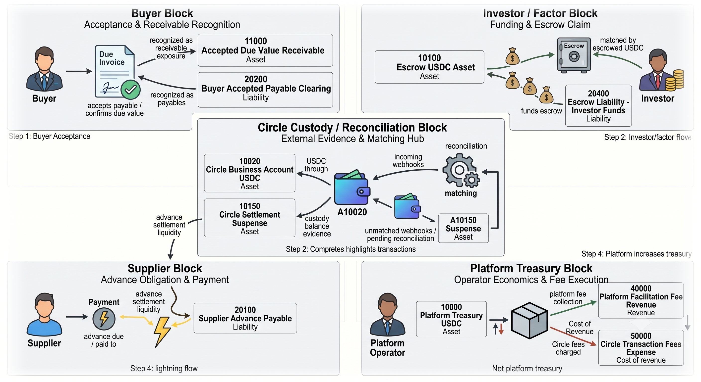
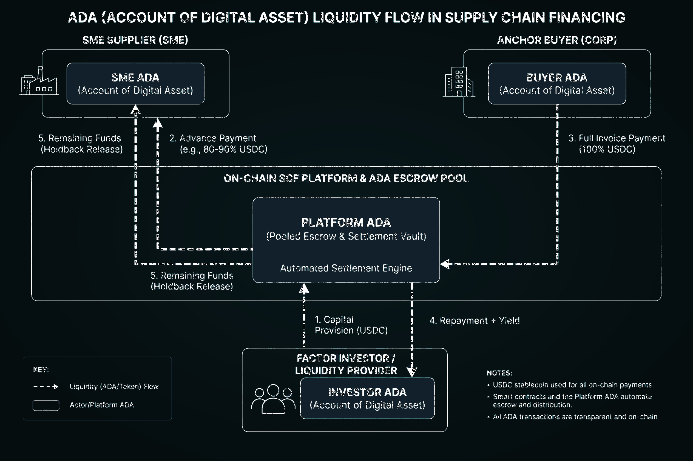

<!-- Slide 1: Title (TOKEN2049 Singapore Edition) -->
# <span style="background: linear-gradient(135deg, #0df294, #38bdf8); -webkit-background-clip: text; -webkit-text-fill-color: transparent;">Connextium.xyz 2026</span>
### TOKEN2049 Singapore • Flagship Pitch Edition
**The Programmable Corporate Treasury Operating System**

<div style="display: flex; gap: 20px; align-items: center; margin: 15px 0;">
  <div style="flex: 1.2;">
    <p style="font-size: 16px; color: #475569; line-height: 1.5;"><em>Unifying corporate dual ledger truth, 24/7 stablecoin cash sweeps, and multi-rail routing — with Supply Chain Finance & Receivables Factoring as our high-yield application across viable segments.</em></p>
    <ul style="font-size: 15px; margin-top: 10px;">
      <li><strong>Core Engine:</strong> Global Trade Treasury (GTT) & Interledger (ILP) Router</li>
      <li><strong>Treasury Core:</strong> Programmable ADA Vaults & Dual Ledger Truth</li>
      <li><strong>The Ask:</strong> <strong>$1.25M Seed for 15% Equity ($8.4M Valuation)</strong></li>
    </ul>
  </div>
  <div style="flex: 0.8; border: 1px solid #0df294; border-radius: 10px; overflow: hidden; box-shadow: 0 4px 14px rgba(13, 242, 148, 0.2);">
    
  </div>
</div>

- **Interactive Web Deck:** [View Web Presentation](./index.html)
- **PDF Pitch Deck:** [Download TOKEN2049 Singapore PDF Deck (15 Slides)](./Connextium.xyz%20—%20TOKEN2049%20Singapore%20Pitch%20Deck%20($1.25M%20Seed%20Round).pdf)

---

<!-- Slide 2: Core Industry Problems -->
# Industry Core Problem: Modernization joint with StableCoin Missed the "Core"
### Non-accomplished success at ISO20022 programs and Blind spot remains in treasury-core architecture.

<div style="display: flex; gap: 20px; margin-top: 14px; align-items: stretch;">
  <!-- Left Half: 3 High-Impact Structural Blind Spots -->
  <div style="flex: 1; display: flex; flex-direction: column; justify-content: space-between; gap: 12px;">
    <div style="background: white; border-left: 4px solid #d97706; border-radius: 8px; padding: 14px 16px; border-top: 1px solid #e2e8f0; border-right: 1px solid #e2e8f0; border-bottom: 1px solid #e2e8f0;">
      <strong style="font-size: 16px; color: #18201d; display: block; margin-bottom: 4px;">01. Messaging ≠ Core Engine</strong>
      <span style="font-size: 14.5px; line-height: 1.5; color: #475569;">ISO 20022 modernized transaction messages, but left legacy batch accounting cores untouched.</span>
    </div>
    <div style="background: white; border-left: 4px solid #0891b2; border-radius: 8px; padding: 14px 16px; border-top: 1px solid #e2e8f0; border-right: 1px solid #e2e8f0; border-bottom: 1px solid #e2e8f0;">
      <strong style="font-size: 16px; color: #18201d; display: block; margin-bottom: 4px;">02. The DLT Perimeter Rush</strong>
      <span style="font-size: 14.5px; line-height: 1.5; color: #475569;">Institutions built outward wrappers rather than solving core ledger synchronization.</span>
    </div>
    <div style="background: white; border-left: 4px solid #e11d48; border-radius: 8px; padding: 14px 16px; border-top: 1px solid #e2e8f0; border-right: 1px solid #e2e8f0; border-bottom: 1px solid #e2e8f0;">
      <strong style="font-size: 16px; color: #18201d; display: block; margin-bottom: 4px;">03. The Control Vacuum</strong>
      <span style="font-size: 14.5px; line-height: 1.5; color: #475569;">Moving tokens wallet-to-wallet without dual ledger controls breaks corporate treasury and audit compliance.</span>
    </div>
  </div>

  <!-- Right Half: 2 Stacked Image Boxes with 2-Lane Inner Layout (1/3 text, 2/3 image) -->
  <div style="flex: 1; display: flex; flex-direction: column; gap: 14px; justify-content: space-between;">
    <div style="border: 1px solid #cbd5e1; border-radius: 8px; padding: 12px 14px; background: #ffffff; display: flex; gap: 14px; align-items: center;">
      <div style="flex: 1;">
        <p style="font-size: 14px; margin-bottom: 2px; color: #0891b2; font-weight: 700;">Liquidity Fragmentation: Multi-Chain Chaos</p>
        <p style="font-size: 12.5px; color: #475569; font-weight: 600; line-height: 1.35;">Liquidity Complexity: Diversity of Chains and Coins</p>
      </div>
      <div style="flex: 2; height: 125px; display: flex; align-items: center; justify-content: center; overflow: hidden; border-radius: 6px;">
        
      </div>
    </div>

    <div style="border: 1px solid #cbd5e1; border-radius: 8px; padding: 12px 14px; background: #ffffff; display: flex; gap: 14px; align-items: center;">
      <div style="flex: 1;">
        <p style="font-size: 14px; margin-bottom: 2px; color: #e11d48; font-weight: 700;">The Control Gap: Wallet Misuse in Treasury</p>
        <p style="font-size: 12.5px; color: #475569; font-weight: 600; line-height: 1.35;">The popular prototype Wallet-to-Wallet "coin transfer" lack support to corporate treasury cash flow in reality.</p>
      </div>
      <div style="flex: 2; height: 125px; display: flex; align-items: center; justify-content: center; overflow: hidden; border-radius: 6px;">
        
      </div>
    </div>
  </div>
</div>

*Core Thesis: Real transformation requires modernizing internal treasury accounting truth — not just moving tokens.*

---

<!-- Slide 3: The Problem -->
# Enterprise Cash Flow emerging inflow of StableCoin
### Global B2B Value Transfer Relies on Broken 1970s Banking Rails

<div style="display: flex; gap: 14px; margin-bottom: 14px;">
  <div style="flex: 1; border: 1px solid #fed7aa; background: #fffdfa; padding: 12px 14px; border-radius: 8px;">
    <strong style="color: #e11d48; font-size: 15px;">$150T Trapped Float</strong>
    <p style="font-size: 13.5px; color: #475569; margin-top: 4px; line-height: 1.4;">Capital sits locked in transit, buffer accounts, and Net-60 invoices.</p>
  </div>
  <div style="flex: 1; border: 1px solid #fed7aa; background: #fffdfa; padding: 12px 14px; border-radius: 8px;">
    <strong style="color: #e11d48; font-size: 15px;">Disconnected Accounting</strong>
    <p style="font-size: 13.5px; color: #475569; margin-top: 4px; line-height: 1.4;">ERP general ledgers, SWIFT wires, and waybills operate in isolated silos.</p>
  </div>
  <div style="flex: 1; border: 1px solid #fed7aa; background: #fffdfa; padding: 12px 14px; border-radius: 8px;">
    <strong style="color: #e11d48; font-size: 15px;">3% to 7% Fee Friction</strong>
    <p style="font-size: 13.5px; color: #475569; margin-top: 4px; line-height: 1.4;">Intermediary wire fees and opaque FX spreads erode corporate margins.</p>
  </div>
</div>

<div style="background: #18201d; color: #d1ded9; padding: 12px 16px; border-radius: 8px; font-size: 14px; margin-bottom: 14px; line-height: 1.5;">
  <strong style="color: #0DBE85;">The CFO's Dilemma:</strong> "Enterprises manage 21st-century supply chains with 1970s batch-processed banking rails. Treasurers lack the infrastructure to program real-time stablecoin cash flows and capture instant invoice yields."
</div>

<div style="border: 1px solid #0891b2; background: #f0fdfa; border-radius: 8px; padding: 12px 16px;">
  <strong style="color: #0891b2; font-size: 14.5px; display: block; margin-bottom: 8px;">The Ledger Divergence: Conventional Accounting vs. DLT & MPC State</strong>
  <div style="display: flex; gap: 12px;">
    <div style="flex: 1; background: #ffffff; padding: 10px 12px; border-radius: 6px; border: 1px solid #e2e8f0; font-size: 13px; color: #334155; line-height: 1.4;">
      <strong style="color: #0f172a;">Conventional System of Record:</strong> State updates through controlled transactions, propagating changes from account to account.
    </div>
    <div style="flex: 1; background: #ffffff; padding: 10px 12px; border-radius: 6px; border: 1px solid #e2e8f0; font-size: 13px; color: #334155; line-height: 1.4;">
      <strong style="color: #0891b2;">DLT & MPC:</strong> Tokenization shifted focus to transitioning & synchronizing state across multiple participants (Multi-Party Computing).
    </div>
    <div style="flex: 1; background: #ffffff; padding: 10px 12px; border-radius: 6px; border: 1px solid #e2e8f0; font-size: 13px; color: #334155; line-height: 1.4;">
      <strong style="color: #d97706;">Authoritative State Problem:</strong> Maintaining consistency across stablecoins, tokenized deposits, and on-chain assets is the core design hurdle.
    </div>
  </div>
</div>

---

<!-- Slide 4: Market Opportunity -->
# Multi-Trillion Dollar Market Opportunity
### Capturing the Enterprise Shift to Programmable Liquidity (Singapore & APAC Hub)

<div style="display: flex; gap: 20px; align-items: stretch; margin: 15px 0;">
  <div style="flex: 1.1;">
    <div style="display: flex; justify-content: space-between; gap: 10px; margin-bottom: 12px;">
      <div style="background: white; padding: 10px; border-radius: 8px; border: 1px solid #cbd5e1; flex: 1;">
        <div class="stat" style="font-size: 28px;">$150 T</div>
        <strong style="font-size: 13px;">Global B2B (TAM)</strong>
      </div>
      <div style="background: white; padding: 10px; border-radius: 8px; border: 1px solid #cbd5e1; flex: 1;">
        <div class="stat" style="font-size: 28px;">$5.2 T</div>
        <strong style="font-size: 13px;">Trade / SCF (SAM)</strong>
      </div>
      <div style="background: #e6f9f3; padding: 10px; border-radius: 8px; border: 1px solid #0DBE85; flex: 1;">
        <div class="stat" style="font-size: 28px; color: #0DBE85;">$25 B</div>
        <strong style="font-size: 13px; color: #0DBE85;">Target SOM</strong>
      </div>
    </div>
    <div style="font-size: 14px; background: white; padding: 12px; border-radius: 8px; border: 1px solid #cbd5e1;">
      <strong>Platform + Application Playbook:</strong><br>
      1. <strong>Build the Rail:</strong> GTT payment router & automated stablecoin cash sweeps.<br>
      2. <strong>Deploy Flagship App:</strong> Verity dynamic discounting capturing immediate volume.<br>
      3. <strong>Expand Ecosystem:</strong> Vertical APIs for fintechs, carriers & neobanks.
    </div>
  </div>
  <div style="flex: 0.9; border: 1px solid #38bdf8; border-radius: 10px; overflow: hidden; box-shadow: 0 4px 14px rgba(56, 189, 248, 0.2);">
    
  </div>
</div>

---

<!-- Slide 5: Platform Architecture -->
# The Connextium Universal Platform Stack
### Layered Architecture Connecting ERP Logic to Programmable Settlement

```
+-----------------------------------------------------------------------------------+
|                        APPLICATION & BUSINESS CASE LAYER                          |
|         [ Verity AI SCF ]   •   [ CDSC Factoring ]   •   [ Dynamic Discounting ]   |
+-----------------------------------------------------------------------------------+
                                         |
                                         v
+-----------------------------------------------------------------------------------+
|               CONNEXTIUM TREASURY ACCOUNTING & PAYMENT CORE (GTT)                 |
|   • Programmable ADA Vaults               • Dual T-Account Journal Engine         |
|   • Interledger (ILP) Multi-Hop Router    • TigerBeetle Microsecond Ledgers       |
+-----------------------------------------------------------------------------------+
                                         |
                                         v
+-----------------------------------------------------------------------------------+
|                         MULTI-RAIL SETTLEMENT ADAPTERS                            |
|       [ Circle USDC / EURC ]   •   [ FedNow / RTP ]   •   [ SEPA Instant ]        |
+-----------------------------------------------------------------------------------+
```

- **< 3s Settlement:** Packetized value routing executes atomic, multi-hop cross-currency transfers in seconds.
- **Dual Ledger Invariants:** Specialized financial ledgers guarantee zero-sum debit/credit balance constraints at 100k+ ops/sec.
- **Multi-Rail Neutrality:** Seamlessly routes value across fiat banking rails and regulated stablecoins.

---

<!-- Slide 6: Corporate Treasury Structure Embedded with Stablecoins -->
# Corporate Treasury Structure Embedded with Stablecoins
### Multi-Tier Institutional Reserve Framework with Circle USDC / EURC



- **Tier 1 — Bank Operating Accounts:** Traditional commercial banking rails handling standard corporate payroll, tax, and fiat wire operations.
- **Tier 2 — Regulated Stablecoin Reserves:** Regulated Circle USDC & EURC liquidity pools enabling instant, 24/7 cross-border settlement without correspondent banking friction.
- **Tier 3 — Programmable ADA Vaults:** Isolated smart treasury vaults holding trade finance escrows with verifiable ledger invariants.
- **24/7 Automated Sweeps & Rebalancing:** Continuous treasury sweeps eliminate trapped float, deploying idle liquidity into dynamic discounting earning **8%–18% APR**.

---

<!-- Slide 7: Dual Ledger & Real-Time ERP Sync -->
# Case Study: Dual Ledger & Real-Time ERP Sync
### Project ADA: Synchronizing General Ledgers with On-Chain Settlement

<div style="display: flex; justify-content: space-between; gap: 15px; margin: 15px 0;">
  <div style="border: 1px solid #cbd5e1; padding: 12px; border-radius: 8px; flex: 1;">
    <strong>EVENT 1: Recognition</strong><br>
    <span style="font-size: 16px; color: #059669;">PO & Invoice Matched</span><br>
    <code>Debit: Inventory $100k</code><br>
    <code>Credit: A/P $100k (Net-60)</code>
  </div>
  <div style="border: 2px solid #0DBE85; padding: 12px; border-radius: 8px; flex: 1; background: #f0fdf4;">
    <strong>EVENT 2: Financing</strong><br>
    <span style="font-size: 16px; color: #059669;">Early Liquidity Payout</span><br>
    <code>Debit: Vendor A/P $100k</code><br>
    <code>Credit: Obligation $98.5k</code><br>
    <strong style="color: #059669;">Yield: +$1.5k (18% APR)</strong>
  </div>
  <div style="border: 1px solid #cbd5e1; padding: 12px; border-radius: 8px; flex: 1;">
    <strong>EVENT 3: Settlement</strong><br>
    <span style="font-size: 16px; color: #0891b2;">Net-60 Maturity</span><br>
    <code>Debit: Obligation $98.5k</code><br>
    <code>Credit: USDC Cash $98.5k</code>
  </div>
</div>

- **GAAP / IFRS Compliance:** Automatic dual journal posting eliminates manual month-end audit friction across SAP & NetSuite.
- **Real-Time Yield Capture:** Anchor buyers earn 8%–18% annualized APR by discounting invoices with idle stablecoin treasury float.
- **Solvency Invariant Truth:** TigerBeetle ledgers enforce strict zero-sum debit/credit balance proofs on every transaction packet.

---

<!-- Slide 8: Account Servicing & Invariants -->
# Precision Account Servicing & Liquidity Invariants
### Precision Multi-Account Liquidity Tracking

- **Asset Liquidity ($\ge 0$):** Pre-funded to absorb cross-currency conversions and stablecoin float.
- **Peer Credit Liquidity ($\ge 0$):** Tracks bilateral connector credit lines in real time across routing hops.
- **Payment Escrow Liquidity ($\ge 0$):** Escrows outgoing & incoming Open Payments during transit until delivery.
- **Settlement Accounts ($\le 0$):** Anchors net institutional deposits vs. withdrawals against banking reserves.

**Performance Benchmarks:**
- **< $0.05** Routing Cost / Txn (vs. $25–$65 bank wire fee)
- **< 0.15%** FX Conversion Spread (vs. 2.5%–4.0% bank spread)
- **100k+** Ledger Transactions / Second (TigerBeetle engine)

---

<!-- Slide 9: Flagship Business Case: Supply Chain Finance -->
# Case Study: Supply Chain Finance & Receivables Factoring
### Unlocking Broader Public Market Liquidity for Invoice Assets vs. Closed Private Networks

```
[ Net-60 Invoice ] ➔ [ Verity AI Scoring ] ➔ [ Tokenized Claim ] ➔ [ Public Liquidity Pool ] ➔ [ Instant USDC Payout ]
```

### Factoring Market Core Differentiator
- **Incumbents (Modern Treasury, SAP Taulia):** Optimize receivables strictly within **closed, private enterprise networks** — limiting factoring liquidity to internal corporate balance sheets or single-bank syndicates.
- **Connextium Differentiator:** **Unlocks broader public market liquidity for invoice assets** — creating a publicly accessible market for invoice factoring where institutional capital, credit funds, and decentralized liquidity pools compete to finance early supplier payouts.

- **For Enterprise Anchor Buyers:**
  - Deploy idle treasury cash or tap external liquidity pools to earn **8% to 18% annualized APR**.
  - Strengthen fragile supplier tiers without adding balance sheet debt or constraining internal working capital.
  - Automated ERP journal reconciliation across dual T-accounts with zero manual intervention.
- **For SME Suppliers & Factoring Market:**
  - Receive instant 24/7 liquidity payouts in USDC or fiat instead of waiting 60–90 days.
  - Access open-market competitive dynamic rates (1.5%–3.0%) vs. predatory 15%–30% traditional factoring rates.
  - Gain access to a deep, publicly accessible liquidity market with zero single-buyer dependency.

---

<!-- Slide 10: ADA Framework Applied on Factoring Finance -->
# ADA Accounting Framework Applied on Factoring Finance
### Account of Digital Asset (ADA): Multi-Entity Ledger Invariants Powering Early Liquidity Payouts



- **Multi-Entity Vault Topology:** Cryptographically isolates **Buyer ADA**, **Supplier ADA**, **Investor ADA**, and **Platform Escrow ADA**.
- **Zero-Sum Balance Invariants:** Strict mathematical rule ($\sum \text{Debit} = \sum \text{Credit}$) guarantees zero double-financing and real-time solvency across all participants.
- **Early Liquidity Payout Swaps:** Smart escrow releases instant USDC liquidity to suppliers upon Verity AI risk scoring, locking maturity claims for investors.
- **Automated Counterparty Mirroring:** Simultaneously updates Buyer, Supplier, and Investor ERP accounts with GAAP/IFRS verifiable journal entries.

---

<!-- Slide 11: Verity AI & CDSC Streaming -->
# Verity AI Risk & CDSC Milestone Escrow
### Combining AI Underwriting with Programmable Cash Flow Streaming

- **Verity AI Risk & Fraud Resolution:**
  - **Multimodal Document Parsing:** Ingests complex multi-currency invoices, POs, and bills of lading in sub-seconds.
  - **3-Way Reconciliation:** Cross-checks invoice data with ERP records, logistics telematics, and supplier fulfillment history.
  - **Cryptographic Anti-Fraud Stamp:** Generates unique invoice fingerprints on-chain to eliminate double-financing risks.
- **CDSC Continuous Settlement Protocol:**
  - **Milestone Escrow Streaming:** Releases micro-payments automatically as freight passes GPS transit gates and customs checkpoints.
  - **Automated Risk Assessment:** **Sub-Second API Execution** (vs. Multi-Day Bank Approval).

---

<!-- Slide 12: Working Alphas & Traction -->
# Built, Deployed, & Testable Today
### Working Alphas Across Treasury Router, Developer APIs, and SCF Application

- **Project ADA / GTT Explorer:** [https://ada-alpha.connextium.xyz/](https://ada-alpha.connextium.xyz/)
  - Live on-chain payment router, multi-tenant dual ledger inspector, and admin console.
- **OpenAPI Documentation Portal:** [https://gtt-apidocs.connextium.xyz/](https://gtt-apidocs.connextium.xyz/)
  - Complete developer specifications for corporate ERP and treasury banking integration.
- **Verity Alpha SCF Application:** [https://verity-alpha.connextium.xyz/](https://verity-alpha.connextium.xyz/)
  - Working AI risk assessment and supplier dynamic discounting portal.
- **Ecosystem Recognition:**
  - Selected Circle Fintech Bootcamp programmable commerce project.
  - Completed Interledger Foundation account servicing entity architecture.

---

<!-- Slide 13: Business Model & Revenue -->
# Multi-Stream Platform Business Model
### Compounding Revenue from Routing Take-Rates, Financing Spreads, and Enterprise SaaS

<div style="display: flex; justify-content: space-between; margin: 20px 0;">
  <div style="border: 1px solid #e2e8f0; padding: 10px; border-radius: 6px; text-align: center; flex: 1; margin: 0 4px;">
    <strong>15–35 bps</strong><br><span style="font-size: 14px; color: #64748b;">Payment Take-Rate</span>
  </div>
  <div style="border: 1px solid #e2e8f0; padding: 10px; border-radius: 6px; text-align: center; flex: 1; margin: 0 4px;">
    <strong>1.0%–2.5%</strong><br><span style="font-size: 14px; color: #64748b;">Financing Spread</span>
  </div>
  <div style="border: 1px solid #e2e8f0; padding: 10px; border-radius: 6px; text-align: center; flex: 1; margin: 0 4px;">
    <strong>$3k–$10k/mo</strong><br><span style="font-size: 14px; color: #64748b;">Enterprise SaaS</span>
  </div>
  <div style="border: 1px solid #e2e8f0; padding: 10px; border-radius: 6px; text-align: center; flex: 1; margin: 0 4px;">
    <strong>Usage Tiered</strong><br><span style="font-size: 14px; color: #64748b;">Developer APIs</span>
  </div>
</div>

### 3-Year Financial Projections
- **Year 1 (Pilot Phase):** $50 Million Settled Volume • 5 Enterprise Anchors • **$750,000 Net Revenue**
- **Year 2 (Corridor Scale):** $350 Million Settled Volume • 60 Enterprise Anchors • **$3,800,000 Net Revenue**
- **Year 3 (Network Scale):** $1.8 Billion Settled Volume • 220 Enterprise Anchors • **$18,500,000 Net Revenue**
*(Gross Margin: > 82% across SaaS subscriptions and routing infrastructure)*

---

<!-- Slide 14: Value Growing Plan (Series A) -->
# Value Growing Plan: Roadmap to Series A
### Clear Execution Milestones Driving 3x–4x Enterprise Valuation Step-Up

```
[ SEED: $1.25M @ $8.4M VALUATION ] ═══> [ 12-18 MO INFLECTION ] ═══> [ SERIES A: $25M-$40M ]
• 15.0% Equity Stake            • $250M+ Run-Rate Volume        • Target Raise: $6M-$10M
• Deployed Working Alphas       • $3.5M+ ARR Run-Rate           • 3x-5x Valuation Step-Up
• 5 Anchor Enterprise Pilots    • Self-Serve Liquidity Pools    • Multi-Corridor Dominance
```

- **Phase 1: Months 1–6 (Operational Proof):** Deploy 5 Enterprise Anchor Buyer pilots; complete SOC2 Type 1 audit & MSB state compliance (BSA/AML, KYB/KYC, OFAC screening); onboard 25 suppliers.
- **Phase 2: Months 6–12 (Volume & Velocity):** Cross $50M cumulative volume across 5 Enterprise Anchors; integrate 3rd-party institutional liquidity pools.
- **Phase 3: Months 12–18 (Series A Inflection):** Hit $250M annualized run-rate ($3.5M+ ARR); launch API partner gateway; execute Series A at **$25M–$40M valuation (3x–5x Step-Up)**.

---

<!-- Slide 15: Leadership & The Seed Ask (TOKEN2049 Singapore) -->
# The Ask: $1.25M Seed Round (15% Equity)
### Valuation round at $8.4 M to Scale Payment Routing & Enterprise Pilots

<div style="display: flex; gap: 20px; align-items: stretch; margin: 15px 0;">
  <div style="flex: 1.25;">
    <div style="display: flex; gap: 10px; margin-bottom: 10px;">
      <div style="background: white; border-left: 4px solid #0DBE85; padding: 10px; border-radius: 6px; flex: 1; border-top: 1px solid #e2e8f0; border-right: 1px solid #e2e8f0; border-bottom: 1px solid #e2e8f0; font-size: 13px;">
        <strong>Round Terms:</strong> $1.25M for 15% Equity ($8.4M Post-Money)
      </div>
      <div style="background: white; border-left: 4px solid #0891b2; padding: 10px; border-radius: 6px; flex: 1; border-top: 1px solid #e2e8f0; border-right: 1px solid #e2e8f0; border-bottom: 1px solid #e2e8f0; font-size: 13px;">
        <strong>Use of Funds:</strong> 45% Eng ($562.5k) • 25% GTM ($312.5k) • 20% Compliance ($250k) • 10% Ops ($125k)
      </div>
    </div>
    
    <div style="font-size: 13px; line-height: 1.4; background: white; padding: 10px; border-radius: 6px; border: 1px solid #e2e8f0;">
      <strong>Leadership:</strong><br>
      • <strong>Tørence Juhe (CEO):</strong> Tier-1 banking systems (Singapore/Europe/Canada) • Singapore Management University (SMU).<br>
      • <strong>Dr. Haroël Lee (Ph.D., Engineering):</strong> AI Models, Cryptographic ledger invariants & multi-chain protocols.
    </div>

    <div style="margin-top: 8px; font-size: 13px;">
      <strong>Contact:</strong> Tørence Juhe • [connexis@connexis.fi](mailto:connexis@connexis.fi) • [https://connextium.xyz](https://connextium.xyz)
    </div>
  </div>
  <div style="flex: 0.75; border: 1px solid #c084fc; border-radius: 10px; overflow: hidden; box-shadow: 0 4px 14px rgba(192, 132, 252, 0.2);">
    
  </div>
</div>

- **Interactive Web Deck:** [View Web Presentation](./index.html)
- **PDF Pitch Deck:** [Download TOKEN2049 Singapore PDF Deck (15 Slides)](./Connextium.xyz%20—%20TOKEN2049%20Singapore%20Pitch%20Deck%20($1.25M%20Seed%20Round).pdf)

