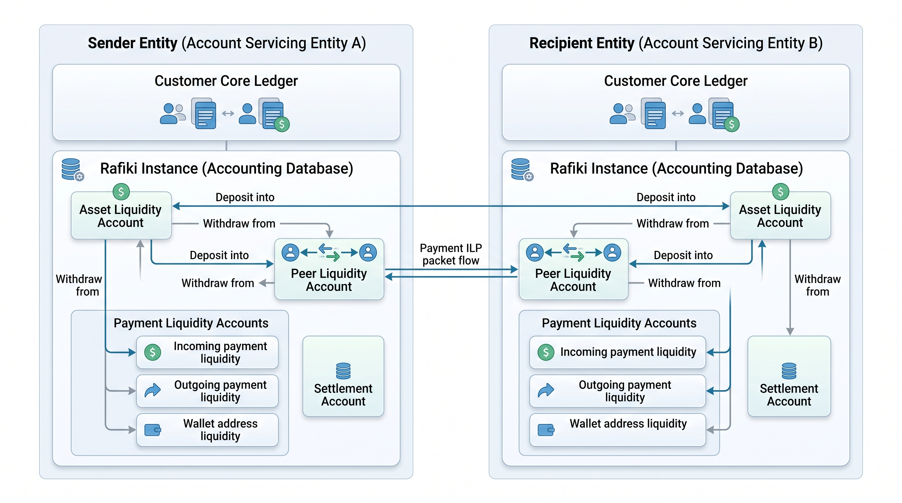

# Entity & Account Relationships in Rafiki Accounting

Rafiki operates on a clear separation between external customer-servicing ledgers (banks, wallets, or financial institutions) and internal liquidity tracking ledgers (powered by TigerBeetle or Postgres).

---

## 1. Ownership & Instance Boundary

* **Account Servicing Entities (Sender & Recipient):** Each entity (e.g., wallet provider, bank, or fintech) hosts its own independent Rafiki deployment.
* **Core Ledger vs. Rafiki Ledger:** Customer accounts (end-user balances) reside on the entity's core banking/wallet ledger. Rafiki never manages customer bank accounts directly; it only tracks internal liquidity to clear and forward Interledger (ILP) packets.

---

## 2. Account Categories & Rules

| Account Type | Main Purpose | Scope / Count | Balance Constraint |
| :--- | :--- | :--- | :--- |
| **Asset Liquidity** | Supports FX / cross-currency packet forwarding. | 1 per transacted asset | $\ge 0$ (Zero or Positive) |
| **Peer Liquidity** | Tracks available credit line extended to an agreed peer. | 1 per peer relationship | $\ge 0$ (Zero or Positive) |
| **Outgoing Payment Liquidity** | Funds reserved to dispatch an Open Payments transaction. | 1 per outgoing payment | $\ge 0$ (Zero or Positive) |
| **Incoming Payment Liquidity** | Holds value received from completed Open Payments. | 1 per incoming payment | $\ge 0$ (Zero or Positive) |
| **Wallet Address Liquidity** | Holds value received via SPSP payments. | 1 per wallet address (reused) | $\ge 0$ (Zero or Positive) |
| **Settlement Account** | Tracks net funds deposited into Rafiki vs. withdrawn. | 1 per transacted asset | $\le 0$ (Zero or Negative) |

---

## 3. Allowed Operations Matrix

### Deposits
* **Asset Liquidity:** Pre-funded to absorb cross-currency fluctuations and conversion requirements.
* **Peer Liquidity:** Injected to establish or reset a peer's credit line after an external settlement.
* **Outgoing Payment Liquidity:** Explicitly deposited from the core sender balance before dispatching an outgoing payment.

### Withdrawals
* **Asset Liquidity & Peer Liquidity:** Withdrawn for rebalancing or reducing extended credit/capital.
* **Incoming Payment Liquidity:** Withdrawn upon payment completion to credit the end recipient's core balance.
* **Wallet Address Liquidity:** Withdrawn upon SPSP payment completion to credit the recipient.
* **Outgoing Payment Liquidity:** Withdrawn if a payment fails or partially completes to refund excess back to the sender.

### Payment Routing (ILP Packet Execution)
* **Inter-Instance Routing:** Interledger packets route value across instances between Peer Liquidity Accounts according to established bilateral credit limits.
* **Intra-Instance Transfers:** Within an instance, multi-phase double-entry transfers move value between Payment Liquidity Accounts and Asset Liquidity Accounts (if currency exchange applies).