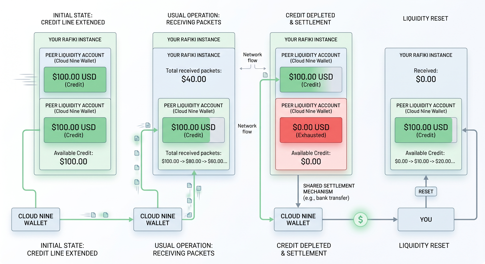

**Peer Liquidity Lifecycle: Cloud Nine Wallet Example**

* **Credit Establishment:** You establish a peering agreement with Cloud Nine Wallet and extend a **$100.00 USD line of credit**, initializing their peer liquidity account balance at **$100.00 USD** on your Rafiki instance.
* **Packet Processing & Depletion:** As Cloud Nine Wallet sends Interledger packets, your Rafiki instance validates and processes incoming transactions up to the $100.00 ceiling, progressively drawing down their available peer liquidity balance toward **$0.00 USD**.
* **Limit Reached:** Once the $100.00 credit limit is fully exhausted, Rafiki automatically halts further incoming packet processing from Cloud Nine Wallet until settlement occurs.
* **Off-Ledger Settlement:** Cloud Nine Wallet settles the outstanding balance by transferring **$100.00 USD** directly to you using your agreed-upon external settlement rail (such as a local clearing network or wire transfer).
* **Liquidity Reset:** Upon verifying the receipt of external funds, you reset Cloud Nine Wallet's peer liquidity account in Rafiki back to **$100.00 USD**, restoring their capacity to route new payments through your instance.